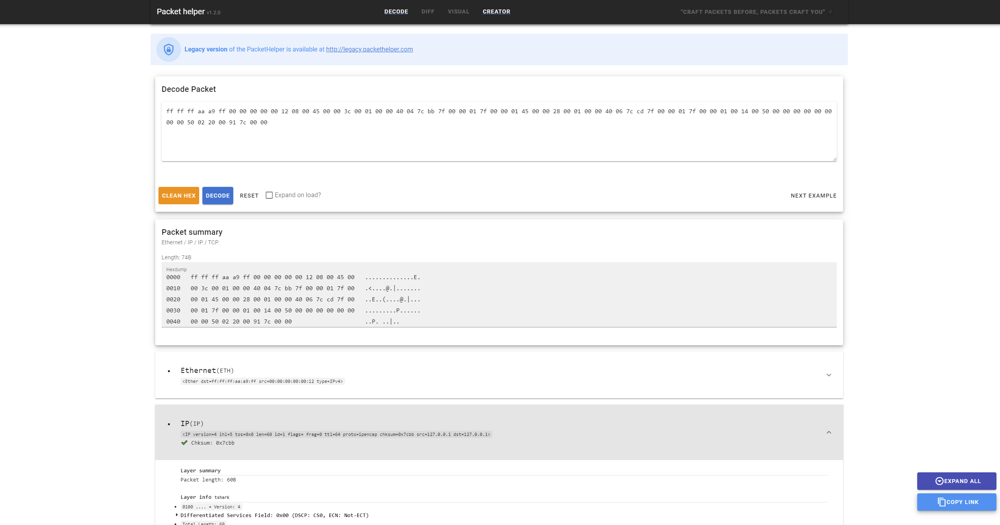
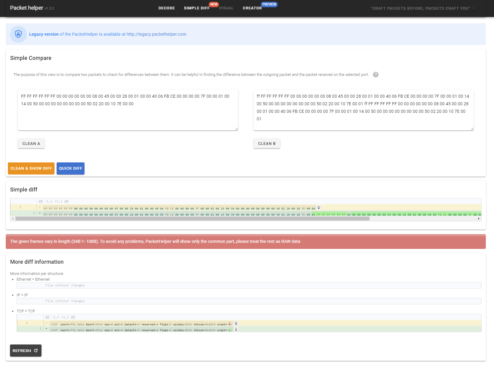

[](https://github.com/PacketHelper/packet-helper-next/actions/workflows/verify_code.yml)
[](https://github.com/PacketHelper/packet-helper-next/actions/workflows/djangotest.yml)
[](https://github.com/PacketHelper/packet-helper-next/actions/workflows/ci.yml)

# Packet Helper Next

This is a next version of the web tool to describe a packet information base on the string of the hex.
All information comes from the Scapy & TShark projects.

Live instance of the application: [packethelper.com](http://packethelper.com)



## Features

### 1.3 Introduce a Compare View

The purpose of this view is to compare two packets to check for
differences between them. It can be helpful in finding the difference
between the outgoing packet and the packet received on the selected
port.



## Usage

Use docker to build application.

```text
docker build . -t ph2
```

To run docker image locally (port value is set be the HEROKU itself). For local usage, you need to specify it manually

```text
docker run --env PORT=8000 -p 8000:8000 -t -i ph
```
